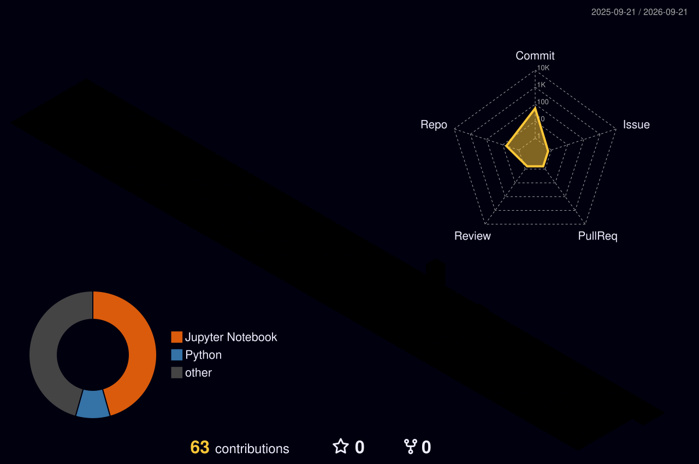

<h1 align="center">
  Hi, I'm Jiwon Lee
  
</h1>

  Undergraduate student studying <b>Statistics</b> and <b>Artificial Intelligence</b> at Ewha Womans University.

  LLM Evaluation · Interpretability · Human-AI Interaction · Mental Health AI

##  Nice ways to reach me

## About Me

- Studying Statistics and Artificial Intelligence at Ewha Womans University
- Interested in LLM evaluation, interpretability, and human-centered AI
- Exploring how large language models represent and use task-relevant information

## Research Interests

## Tech Stack

## 3D Contribution Graph

